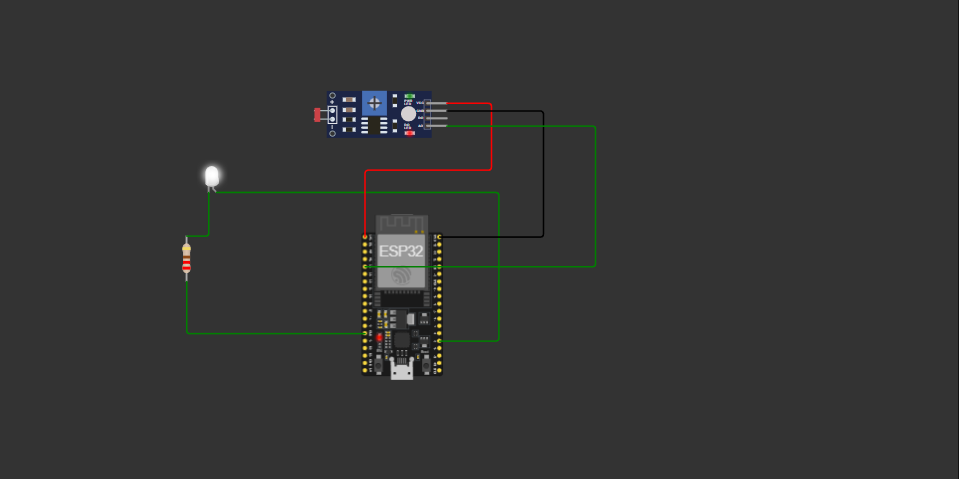

# 💡 OMORI Light System - IoT & Spring Boot

Este projeto é um sistema de iluminação inteligente inspirado na estética do jogo **OMORI**. Ele permite monitorar a luminosidade de um ambiente através de um sensor LDR (simulado no Wokwi) e controlar um LED (a lâmpada do White Space) de forma automática ou manual através de uma interface Web.

## 🚀 Tecnologias Utilizadas

- **Backend:** Java 17, Spring Boot 4.0, Spring Data JPA.
- **Banco de Dados:** MySQL.
- **Frontend:** HTML5, CSS3 (Estilo Omori), Thymeleaf.
- **IoT/Hardware:** ESP32, Sensor LDR, LED (Simulados no Wokwi).
- **Comunicação:** Cloudflare Quick Tunnel (Exposição da API).

---

## 🛠️ Como Instalar e Rodar o Sistema

### 1. Requisitos Prévios
- Java JDK 17 instalado.
- MySQL Server rodando.
- [Cloudflare (cloudflared)](https://developers.cloudflare.com/cloudflare-one/connections/connect-networks/do-it-fast/quick-start/) ou Ngrok instalado.

### 2. Configuração do Banco de Dados
Crie um banco de dados no seu MySQL Workbench:
```sql
CREATE DATABASE iluminacao;




